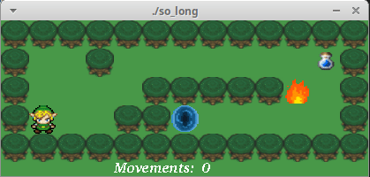
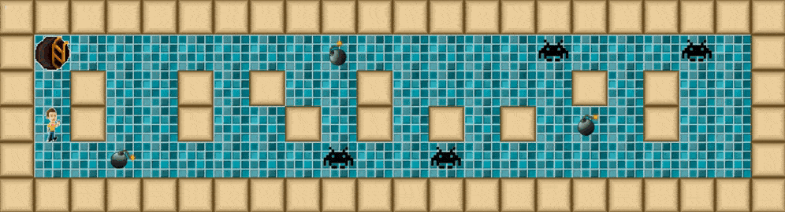
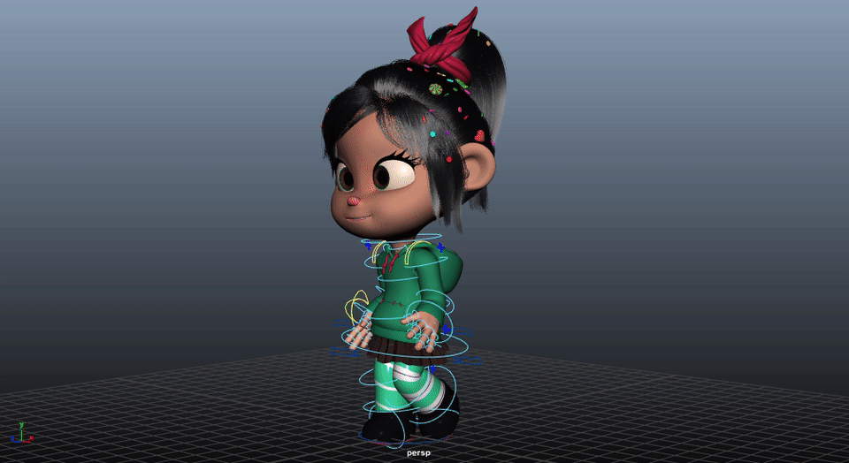

**By Sheldon Chong**
11.3.2025


# Building an Isometric Game in C

## Introduction: What is so_long?

so_long is one of the earlier projects in 42’s Core Program. The objective of so_long is to create a 2D, interactive top-down game, using an barebones C graphics library called MiniLibX.

- Players must use keys to move their player around and collect collectibles, to make their way towards the exit. 
- As a bonus, players may also incorporate various elements such as animation, enemies and enemy AI, amongst other things.

The conventional approach to this project is to make a flat, 2D grid-based game, as I’ve observed from many cadets who worked on the same project.


[https://github.com/JCluzet/so_long](https://github.com/JCluzet/so_long)

<br>


[https://github.com/andersonhsporto/ft-so_long](https://github.com/andersonhsporto/ft-so_long)


Interestingly, the requirements for this project were pretty loose. I used it as the green flag to work on it using an unconventional approach…

---

# My approach to so_long

<video width="320" height="240" controls>
  <source src="so_long_demo.mp4" type="video/mp4">
</video>

I had the ambitious idea of attempting to make my project a real-time, side-scrolling, stealth-based, isometrically-rendered game. 

The game features the following:

- **Enemy AI**, designed in a way that would allow the player to remain undetected under certain conditions. 

	- Enemies remain idle and look around until a player falls within an enemy’s line of sight. In such situations, they will become aggravated, and chase after the player.

- **A camera** that glides gracefully towards the player, keeping it in focus. This illusion was created by rendering the pixels using an offset value and basic smoothing. 

- **Isometric appearance:** I designed assets in a form which connects seamlessly along with other tiles on a diagonally angled axis.

	- All calculations done in the engine have to be mapped to diagonal space, before being rendered to the screen.

This article serves as a walkthrough that will explain how I’ve gone about implementing these features.

---

# Basic term definitions and distinctions for 2D games

| **Side-Scroller** | **Fixed-screen** |
|-------------------|------------------|
|  |  |
| Camera follows player, as they traverse through the world | Camera stays in place, or the entire world is viewable without requiring camera to track player |

<br/>

| **Isometric rendering** | **Top-down/side-view rendering** |
|-------------------------|----------------------------------|
|   |   |
| Tiles are rendered diagonally (or diamond-shaped). Gives the illusion of depth and dimension. | Tiles can typically fit within a square, and are typically drawn from top-to-bottom, left-to-right |

<br/>

---

# 📦 Displaying a grid isometrically


<br/>

There are several methods of rendering pixels isometrically. I will cover what I consider to be the simplest approach. The general concept to map a pixel to an isometric plane is to simply give a ratio/relationship between the X and Y coordinates. 

- a certain amount of X is equal to a certain amount of Y and vice-versa 

- By increasing the X, the Y should also change by a percentage of the X 

This concept is illustrated below

| **text** | **image** |
|--------------|--------------------|
| This is the X and Y axis of a flat 2D plane. In the middle is the player |  |
| If the player were to increase their X value, they would move towards the right, like so |  |
| Now, this is the Isometric grid that you may be familiar with |  |
| Notice how it has a skewed version of the X and Y axis |  |
| This is the player at the center of the grid: |  |
| By increasing the player’s X, the player will move forward on the X axis |  |
| If we observe the player’s movement on the canvas, noticed how by increasing the X, the player moves somewhat diagonally. This contrasts how we saw the player move in a 2D grid when only its X position increased. In that instance, the player only move to the right |  |
| We can observe that by increasing the X value of the player, the Y increases by a certain amount as well. This means that we need to develop a formula correlates a player’s X with its Y. |  |

Now, we need to find a way to put this theory into action. In a game, we have what I shall term “true coordinates”, which are is the variable that keeps track of the position an object, such as the player.

- For example, (0,0) means the player is at the center.

However, as established in an isometric display, the position that the player is mapped onto the screen will be different than the true value

This implies that there are two sets of coordinates we need to care about: The true coordinates (where the object actually is), and the isometric coordinates (where the object is rendered on the screen) *


<br/>

💡 **Basic isometric mapping formula**

This is the formula to get a X position mapped onto a Isometric plane, given the X and Y coordinates of the player: 

$ m $ represents the “slope”: how much a increase in $ X $ results in an increase $ Y $. 

$$ x\ =\ m\left(x_{1}+y_{1}\right) $$

And the formula to get the Y position of the player

$$ y = \frac{\left(x_{1}-y_{1}\right)}{m} $$

Combine both:

$$ \left\{x,\ y\right\}\ =\ \left\{m\left(x_{1}+y_{1}\right), \frac{\left(x_{1}-y_{1}\right)}{m}\right\} $$

With this formula, we can create the following function that will give us a new set of coordinates in an isometric plane based on a given set of coordinates.

(No struct):


```c
void iso_map(int x, int y)
{
	int iso_x = (x + y) * 1.4; 
	int iso_y = (x - y) / 1.4;
	
	// do something
}
```

(Using a struct to group coordinates):


```c
t_xy iso_map(t_xy pos)
{
	t_xy iso_pos;
	iso_pos.x = (pos.x + pos.y) * 1.4;
	iso_pos.y = (pos.x - pos.y) / 1.4;
	return iso_pos;
}
```

<br/>

💡 Using [Desmos](https://www.desmos.com/calculator/gewxhbpklh), we can simulate the relationship live using this same formula.
$ x_1 $ and $ y_1 $ are the true position, while the green dot represents the isometrically mapped position.


- $ x = 1 $

	

- $ y = 1 $

	

<br/>

### Tiling isometrically

After understanding how to retrieve a position’s isometric counterpart, we may then use this logic to lay out each tile and form the world.


<div align="center">

This is an example of a tile asset that I drew:


</div>

A series of these tiles are aligned at fixed intervals, to form the world we see. 

Let’s say we want to render a 3x3 world. The basic way to go about it would be to increment x by an interval, and place an image at each increment.

For example, lets start by drawing our first row of squares, with each square being 20px in width. This means we have to increment by 20 to draw at the start of the next square:


<br>

<br>

<br>
<p>That was one row. Using the same steps, we then draw 2 more rows, but each row has a different starting y value. Just like $ x $, we increment the $ y $ by 20</p>


Our 3x3 world is complete. 

Let’s apply the same logic but this time, render isometrically. To breakdown the problem, let’s first map the points:

| **X Value** | **Image** |
|-------------|-----------|
| $ x=0 $     |  |
| $ x=20 $    |  |
| $ x=40 $    |  |

We have completed the first row. Next, we will increment the y, and draw the rows again

1. Cycle 2:

	

	1. Cycle 3:

	

	<br/>

	With all positions mapped, we can then iterate. For each row, we start from the back instead of the front. Reversing the order of render is necessary to ensure that the images overlap properly.
	<span style='color:gray'>(you can try for yourself what happens when it is rendered starting from </span><span style='color:gray'>`(0,0)`</span><span style='color:gray'> instead of the last position)</span>

	

	

	

	

	

---

<br/>

Now, we have our 3x3 world |  |
|------------------|-----------|
Of course, we may want to populate it with other objects. Positioning objects atop an existing world will require the help of a third coordinate, $ Z $. |  |
Once again, let’s refer to the way the x and y coordinate travel as they increase/decrease. When the x increases, the position travels towards the top right. When the y increases, the position travels to the bottom right. We will also introduce something known as the z coordinate. The Z coordinate determines how high/low the object renders. Think of it as the true vertical axis (i.e. a substitute for the original Y axis that no longer applies in an isometric world). The Z coordinate is useful for rendering several layers of tiles. When the z coordinate increases, the position travels upwards. |   (the Z values here are only for demonstration purposes. They don’t represent the real height of the tiles) |

<br/>

When it comes to rendering the world, there is a certain order to rendering the tiles. This order involves starting at the lowest/bottom-most layer (e.g.) floor, and working your way to the top (walls, player, troops). 


In my game, there are only two of such layers: The floor layer and the wall layer.

1. Start by rendering first layer: Floor

	

2. Increase Z value

3. Render layer 2: Objects

	

Typically 2 layers is the easiest to work with. Having more layers introduces some additional complexities, however it is outside the scope of this article.

# Isometric Assets


<br/>

For the game to render properly in isometric format, graphics have to also adapt to such a format. This meant that the every asset had to abide by the following guidelines:

1. Tiles must be diagonally angled, with a diagonal edge that share the same steepness.

1. Tiles must be symmetrical

However, a property of isometric graphics is that it allows leeway in terms of sprite height and sprite visuals. Theoretically, I could make a sprite as tall as I wanted, and if rendered with the correct order, it would still display properly

<br/>

## 🏃 Animations

Two types of animation were applied to this project; Frame-by-frame animation and interpolation-based animation

<br/>

keyframe animation??


**Frame-by-Frame Animation**

In this method, every frame is individually drawn or created. When played in sequence, these frames create the illusion of movement. Below is an example of a sprite-sheet with frame-by-frame animation:


By: [https://www.deviantart.com/spongedrew250/art/Sonic-Sonic-Running-Sprite-Sheet-920021662](https://www.deviantart.com/spongedrew250/art/Sonic-Sonic-Running-Sprite-Sheet-920021662)

**Interpolation-Based Animation**

This method uses algorithms and calculations to smoothly transition an object or character from one position, scale, or rotation to another over time.


This is interpolation in its most basic representation. Using calculations, the position of the circle is moved towards its destination smoothly. This method is commonly used when dealing with rigs or 3D models that consist of joints and connected parts.




By: [https://www.deviantart.com/spongedrew250/art/Sonic-Sonic-Running-Sprite-Sheet-920021662](https://www.deviantart.com/spongedrew250/art/Sonic-Sonic-Running-Sprite-Sheet-920021662)

When it came to frame-by-frame animation, things were fairly straightforward, as I simply had 2 frames to alternate between every second.

However, when it came to making the enemy troops move towards the player, having a frame-by-frame preset animation would be unsuitable, as there are simply too many frames and possible directions the enemy can move in.

<br/>

The enemy should glide towards the player. 

There were several approaches to animated movement in my game; For example, I could use **linear interpolation**, which uses the expression $ A + (B - A) * t $ to calculate where a point in space should be between a start and end destination at a given time. 

However, lerping has 2 major issues:

- using lerping for animation is as suggested by its name — linear — meaning a position travels at a fixed speed, hence it tends to look stiff. 

- Furthermore, it also has a time factor in its equation, meaning that animating position using lerping, like moving a player or a camera object requires a time value, which has to be kept track of by that object. However, I wanted animations to be handled dynamically and adaptively, without reliance on time. My desired interpolation function should only take a start-destination, end-destination, and return a value that automatically interpolates between the two.

<br/>

**A surprisingly simple solution:**

To interpolate between two values, a function would look something like this


```c
t_xy	interpolate(int value1, int value2, int slowness)
{
	return ((t_xy){(value1 + (value2 - value1) / slowness),
}
```

<br/>

Applying interpolation can be done in positions as well


```c
t_xy	interpolate(t_xy pos, t_xy pos2, int slowness)
{
	return ((t_xy){(pos.x + (pos2.x - pos.x) / slowness), (pos.y + (pos2.y - pos.y) / slowness)});
}
```

<br/>

This kind of interpolation does not require a time value to keep track of. Instead, by simply passing the current position, and the end-destination position, this function returns the interpolated position. 

An object that is moving towards a destination using such an interpolation method will have to constantly assign its “current position” to the “interpolated position”, returned by calling this function with the necessary parameters.

<br/>

---

## 📷 Camera tracking

The illusion of a camera in videogames involves the offsetting of the world. When we think of a static-screen game, the image of a player moving around a static world comes to mind.

<br/>

However, whenever we look at games that utilize camera tracking, there is a typical pattern where the player will always remain at the center of the screen, and the world around the player moves. This concept is how we execute the illusion of a camera; by not actually moving the player, but the objects around it.

<br/>

This means that all objects in the world are rendered at their positions, however they must be off-setted using an offset coordinate value. 

This offset is determined by the camera, and the coordinates where the world is rendered has an inverse relationship to the position of the camera. If you sit on a train moving to the north, you will see everything in the window moving southward. By moving the camera to the right, the world should move to the left, and vice versa. 

<br/>

Using the animation function, I can achieve smooth camera movement.

Furthermore, I attached the camera’s position to the mouse, so by moving the mouse, the camera move’s towards it to a certain extent.

<br/>

<br/>

---


[//]: # (link_preview is not supported)

---

<br/>

